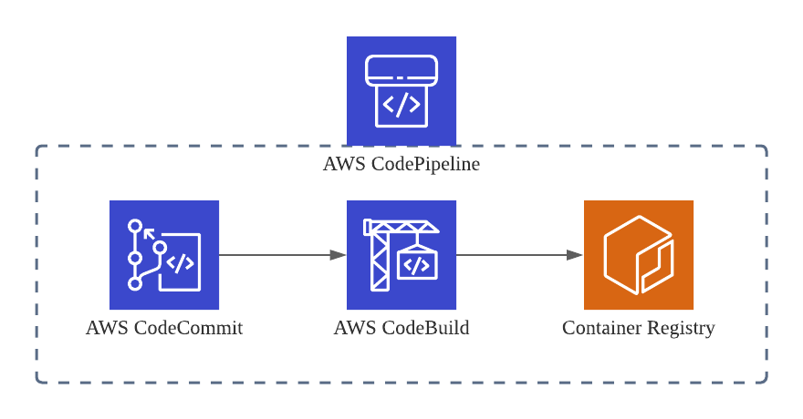

# ECR Pipeline

지속적인 통합 및 배포(CI)을 위해, AWS에서 CodeCommit, CodeBuild, ECR을 CodePipeline으로 구성한 아키텍처 입니다. 이 아키텍처는 소프트웨어 개발 후, 배포를 하기위한 통합 프로세스를 자동화하여 소스 코드를 효과적으로 관리하고 변경 사항을 빠르게 통합할 수 있도록 합니다.

- **AWS CodeCommit**:
CodeCommit은 AWS에서 호스팅되는 완전 관리형 Git 저장소 서비스입니다. 개발자는 CodeCommit을 사용하여 소스 코드를 저장, 관리 및 협업할 수 있습니다. CodeCommit은 안전하고 확장 가능하며, 표준 Git 명령 및 도구를 사용하여 코드를 관리할 수 있습니다.

- **AWS CodeBuild**:
CodeBuild는 완전 관리형 빌드 서비스로, 소스 코드를 컴파일하고 테스트하여 실행 가능한 소프트웨어 패키지를 생성합니다. CodeBuild는 소스 코드가 변경될 때마다 자동으로 빌드 프로세스를 실행하므로 개발자는 코드 변경 사항에 대한 피드백을 신속하게 받을 수 있습니다. 또한 다양한 빌드 환경을 지원하므로 다양한 프로그래밍 언어 및 프레임워크를 사용할 수 있습니다.

- **Amazon ECR** (Elastic Container Registry):
ECR은 Docker 컨테이너 이미지를 저장, 관리 및 배포하는 완전 관리형 Docker 컨테이너 레지스트리 서비스입니다. CodeBuild가 생성한 Docker 이미지를 ECR에 업로드하여 안전하게 저장하고 관리할 수 있습니다. 또한 ECR은 다양한 배포 환경에서 컨테이너 이미지를 사용할 수 있도록 통합되어 있습니다.

- **AWS CodePipeline**:
CodePipeline은 지속적인 통합 및 배포(CI/CD) 서비스로, 소프트웨어 변경 사항을 자동으로 빌드, 테스트 및 배포하는 파이프라인을 생성하고 관리합니다. CodePipeline은 여러 단계로 구성되며, 각 단계는 CodeCommit, CodeBuild, ECR 등과 같은 다양한 AWS 서비스와 통합될 수 있습니다. 개발자는 소프트웨어 변경 사항이 저장소에 푸시될 때마다 CodePipeline이 자동으로 해당 변경 사항을 빌드하고 배포하는 프로세스를 설정할 수 있습니다.

## AWS CodePipeline Terraform Configuration

이 리포지토리는 AWS CodePipeline을 사용하여 소프트웨어 개발 및 통합 프로세스를 자동화하는 Terraform 구성을 포함하고 있습니다. 해당 Terraform 코드를 사용하면 CodeCommit, CodeBuild, ECR을 포함한 AWS 서비스를 손쉽게 구성할 수 있습니다.

**사용 방법**

1. 해당 리포지토리를 클론합니다.
2. `terraform.tfvars` 파일을 생성하고 필요한 변수를 설정합니다.
3. `terraform init` 명령을 실행하여 Terraform을 초기화합니다.
4. `terraform plan` 명령을 실행하여 변경 사항을 확인합니다.
5. `terraform apply` 명령을 실행하여 변경 사항을 적용합니다.
